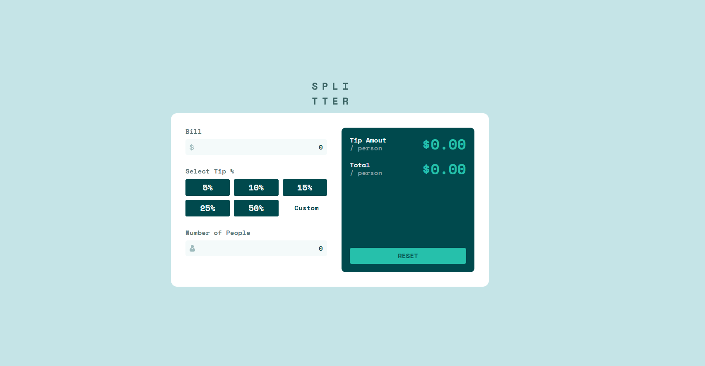

# Frontend Mentor - Solución de aplicación de calculadora de propinas

Esta es una solución al [Desafío de la página calculadora de propinas en Frontend Mentor](https://www.frontendmentor.io/challenges/tip-calculator-app-ugJNGbJUX). Los desafíos de Frontend Mentor lo ayudan a mejorar sus habilidades de codificación mediante la creación de proyectos realistas.

## Tabla de contenidos

- [Resumen](#resumen)
  - [El reto](#el-reto)
  - [Captura de pantalla](#captura-de-pantalla)
  - [Enlaces](#enlaces)
- [Mi proceso](#mi-proceso)
  - [Construido con](#construido-con)
  - [Lo que aprendí](#lo-que-aprendí)
  - [Recursos útiles](#recursos-útiles)
- [Autor](#autor)

## Visión general

### El reto

Los usuarios deben ser capaces de:

- Ver el diseño óptimo para la aplicación según el tamaño de pantalla de su dispositivo
- Ver estados de desplazamiento para todos los elementos interactivos en la página
- Calcule la propina correcta y el costo total de la factura por persona

### Captura de pantalla



### Enlaces

- URL de la solución: [@jhonnymosquera](https://www.frontendmentor.io/solutions/tip-calculator-app-uYdSXW2UF6)
- URL del sitio en vivo: [calculadora de propinas](https://tip-calculator-jjmm.netlify.app/)

## Mi proceso

### Construido con

- Marcado HTML5 semántico
- Propiedades personalizadas de CSS
- Flexbox
- Grid layout
- Flujo de trabajo móvil primero
- [React](https://reactjs.org/) - Libreria de javascript
- [Sass](https://sass-lang.com/) - Para los estilos
- [Gulp](https://gulpjs.com/) - Para el compilado de Sass a css

### Lo que aprendí

Este proyecto tuve oportunidad de seguir aprendiendo sobre react en este caso sobre el hook useReducer, El cual me permitio manejar el estado global de manera mucho mas clara.

```javascript
function ContextProvider({ children }) {
	// reducers
	const errorRefs = {
		errorBill: useRef(),
		errorBillSpan: useRef(),
		errorSelectSpan: useRef(),
		errorNumberOfPeople: useRef(),
		errorNumberOfPeopleSpan: useRef(),
		tipsRef: useRef(),
		tips: [5, 10, 15, 25, 50],
	};
	const [error, errorDispatch] = useReducer(errorReducer, errorRefs);
	const [value, valueDispatch] = useReducer(valueReducer, initialValues);
	const [result, resultDispatch] = useReducer(resultReducer, initialResult);

	const reset = () => {
		valueDispatch({ type: VALUE_TYPES.RESET });
		errorDispatch({ type: ERROR_TYPES.TIPS_REMOVE });
		reusltReset();
	};

	const reusltReset = () => {
		resultDispatch({ type: RESULT_TYPES.RESET });
	};

	useEffect(() => {
		valueDispatch({ type: VALUE_TYPES.VALUE });
		resultDispatch({ value });
		errorDispatch({ type: ERROR_TYPES.ERROR, value });

		if (value.bill != '') {
			resultDispatch({ type: RESULT_TYPES.TA, value });
		} else {
			reusltReset();
		}
	}, [value]);

	return (
		<Context.Provider
			value={{
				logo,
				iconDollar,
				iconPerson,
				value,
				valueDispatch,
				VALUE_TYPES,
				error,
				errorDispatch,
				ERROR_TYPES,
				reset,
				result,
			}}
		>
			{children}
		</Context.Provider>
	);
}
```

### Recursos útiles

- [useReducer](https://es.reactjs.org/docs/hooks-reference.html#usereducer/) - Documentacion del hook, me sivio mucho para aprender a usarlo.
- [substf](https://developer.mozilla.org/es/docs/Web/JavaScript/Reference/Global_Objects/String/substr) - aprendi a usar esta funcion para quitar el % de los bonotes, devuelve el string desde una locacion inicial y una final

## Author

- Frontend Mentor - [@jhonnymosquera](https://www.frontendmentor.io/profile/jhonnymosquera)
- Twitter - [@jhonnymosquera_](https://twitter.com/jhonnymosquera_)
- Gmail - [jhonnymosquera16@gmail.com](https://www.gmail.com)
